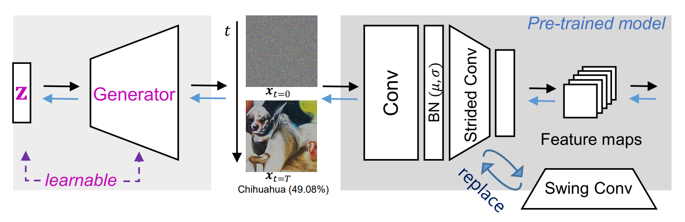

# Genie: Show Me the Data for Quantization
This repository provides the PyTorch implementation of our CVPR 2023 paper ["Genie: Show Me the Data for Quantization"](https://arxiv.org/abs/2212.04780).



## Getting Started
### Installation
```bash
git clone https://github.com/SamsungLabs/Genie
cd Genie
pip3 install -r requirements.txt
```

### Usage
```bash
# Zero-Shot Quantization (PTQ)
python3 main.py --model_name=resnet18 --bit_w=4 --bit_a=4 --samples=1024 --val_path=IMAGENET_PATH/val

# or Few-Shot Quantization (PTQ)
python3 main.py --model_name=resnet18 --bit_w=4 --bit_a=4 --samples=1024 --train_path=IMAGENET_PATH/train --val_path=IMAGENET_PATH/val 
```
Detailed descriptions of arguments are provided in [main.py](main.py).

## Citation
If you find this work useful for your research, please cite our paper:

    @InProceedings{jeon2023genie,
        author    = {Jeon, Yongkweon and Lee, Chungman and Kim, Ho-young},
        title     = {Genie: Show Me the Data for Quantization},
        booktitle = {Proceedings of the IEEE/CVF Conference on Computer Vision and Pattern Recognition (CVPR)},
        year      = {2023},
    }

## License
This project is released under the [Apache 2.0 License](LICENSE).